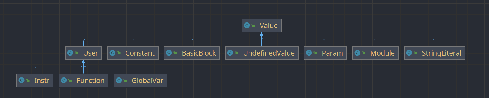
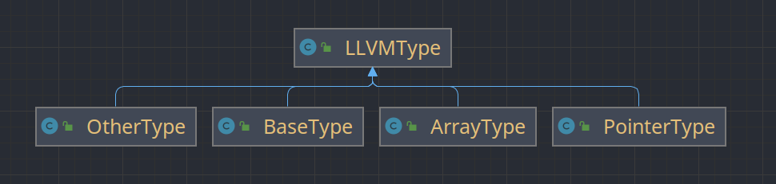
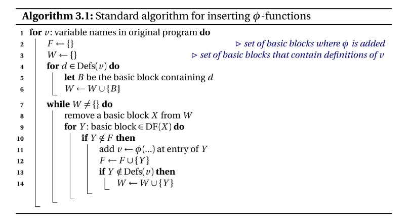

# Petrichor

$\tt{Petrichor}$ 是采用Java语言编写的MIPS编译器（以 LLVM IR 作为中间代码）

## 编译器总体设计

### 总体结构

编译器分为前端、中端、后端三部分——

- 前端：词法分析、语法分析、语义分析，最终将源程序生成为LLVM IR
- 中端：中间代码优化，包括mem2reg，GVN，图着色寄存器分配，死代码删除，常量计算
- 后端：目标代码生成，即将LLVM IR进一步翻译成MIPS代码

### 文件组织与接口

编译器项目结构如下所示

```
├─src
│  ├─back_end       	# 后端    
│  │  └─mips  
│  │      └─assembly
│  ├─exception
│  ├─front_end          # 前端
│  │  ├─AST
│  │  │  ├─Exp   
│  │  │  ├─Func
│  │  │  ├─Stmt
│  │  │  └─Var
│  │  ├─lexer
│  │  ├─parser
│  │  └─symbol			
│  ├─llvm_ir			# LLVM IR定义
│  │  ├─initial
│  │  ├─instr
│  │  └─type
│  ├─mid_end            # 中端
│  ├─utils              # 工具类
│  └─Compliler.java     # 入口程序
└─script                # 测试脚本

```

从入口程序Complier.java中，我们可以看出不同部分之间的接口——

```java
// token analyse
Lexer lexer = new Lexer(input);
TokenStream tokenStream = lexer.getTokenStream();
// syntax analyse
Parser parser = new Parser(tokenStream);
Node compUnit = parser.parseCompUnit();
// check error
compUnit.checkError();
Printer.printAllErrorMsg();
// generate IR
IRBuilder.mode = IRBuilder.AUTO_INSERT_MODE;
compUnit.genIR();
Module module = IRBuilder.getInstance().getModule();
Printer.printOriLLVM(module);
// optimize
IRBuilder.mode = IRBuilder.DEFAULT_MODE;
Optimizer.getInstance().run(module);
// generate MIPS
module.toAssembly();
AssemblyTable assemblyTable = MipsBuilder.getInstance().getAssemblyTable();
Printer.printMIPS(assemblyTable);
```

大体流程是——

- Lexer类解析源程序，将源程序按照词法解析成一个个token，并封装成token流（TokenStream类）。
- Parae类获取Lexer类解析出来的token流，按照文法规则构建抽象语法树（AST），构建完成后返回AST的根节点（compUnit）。
- 从AST根节点开始，自顶向下递归调用每个节点的checkError方法，进行错误检查。
- 从AST根节点开始，自顶向下递归调用每个节点的genIR方法，生成中间代码，并由IRBuilder返回封装好的LLVM IR顶层模块——module。（IRBuilder是一个单例模式类，统一管理中间代码的生成过程）。
- 将module传入Optimizer类, 启动run方法，对module进行优化——mem2reg，GVN，图着色寄存器分配，死代码删除，常量计算，简单乘除优化 (Optimizer是一个单例模式类，统一管理中间代码的优化过程)。
- 调用module类的toAssembly方法，自顶向下递归调用每个LLVM相关类的toAssemply的方法，进行中间代码生成，并由MipsBuilder返回封装好的mips指令列表assemblyTable。（MipsBuilder是一个单例模式类，统一管理中间代码的翻译过程）。


## 前端

### 词法分析

词法分析主要由Lexer类实现。首先，我们将源文件转化为输入流（笔者采用的是可回退的输入流——PushbackInputStream），然后依次读取每个字符，按照下面的词法规则进行解析——


每识别出一个token，我们就将其封装到下面的Token类中。其中TokenType为表示token类型的枚举类，value为token本身的名称，lineNumber是Token所在的行号（便于在错误处理时输出出错行号）。

```java
public class Token {
    private TokenType type;
    private String value;
    private int lineNumber;
}
```

当识别完所有的token后，我们将其封装成TokenStream类，便于后续语法分析的使用。

```java
public class TokenStream {
    private ArrayList<Token> tokenList;
    private int pos;
    private int watchPoint;

    public TokenStream(ArrayList<Token> tokenList) {
        this.tokenList = tokenList;
        this.pos = 0;
        this.watchPoint = 0;
    }
```

在识别的过程中，有下面几个细节需要注意——

- 换行符在不同平台上的表示是不同的，Windows下为`\r + \n`，linux下为`\n`。为了保证编译器在不同平台上的可迁移性，我们需要对其进行特殊处理——无论是哪种表示，换行符中必定有`\n`，因此我们遇到`\r`时直接忽略即可，只以`\n`作为换行标志。
- 对于`!=, ==, >, >=, <, <=, =, ==, //, /, /* `，只读一个字符是无法进行判断的，需要向前多读一个字符。
- 标识符和关键字是无法通过预读进行区分的。我们可以先按照标识符的词法规则进行识别，然后再判断它是否和某个关键字相同。
- Java采用Unicode编码，每个字符（char）是用两个字节表示的。由此，文件结束符应该表示为`\uFFFF`，这一点需要注意。

### 语法分析

语法分析主要由Parser类实现——Parser将词法分析阶段解析出来的token流作为自己的成员变量，然后按照文法规则对token流进行递归下降分析，同时构建出语法树。

#### 文法规则重构

为了便于语法分析以及后续阶段的处理，我们在这里对文法规则进行了一定的调整，和原文法相比有以下几点不同——

- 删除Decl，BType，BlockItem这三个语法变量，精简文法。
- 将Stmt产生式改写为——`Stmt ==> AssignStmt | ExpStmt | BlockStmt | IfStmt | WhileStmt | BreakStmt | CReturnStmt | GetIntStmt | PrintfStmt`，即为每一种Stmt创建一个语法变量，并添加新的产生式。在后面递归下降分析时，我们可以为每一种Stmt单独设置一个函数进行解析，这样可以防止出现超大型函数，便于后期调试。
- 将AddExp，MulExp，RelExp，EqExp， LAndExp，LOrExp改写为巴克斯范式，消除左递归，便于递归下降分析。

#### 语法树相关类

我们为每一个语法变量都创建一个对应的语法树节点，并且都继承自基类Node。Node类的定义如下所示——

```java
public class Node {
    protected int startLine;
    protected int endLine;
    protected SyntaxVarType type;
    protected ArrayList<Node> children;
}
```

- startLine和endLIne分别表示该“语法变量对应的字符串的开始行号和结束行号”，实际上就是对应token串中第一个token的lineNumber和最后一个token的lineNumber。
- SyntaxVarType是表示语法变量类型的枚举类。
- children表示该节点的子节点，用于形成树型结构。

> 文法规则中还有一些独立的token，他们直接出现在产生式的右侧。这些token同样是“所在产生式的语法变量”的children。因此，我们除了为每一个语法变量建立节点类，还要单独建立一个TokenNode类，表示由token构成的树节点。很显然，语法树的所有叶子节点都是TokenNode。

因为我为每一个语法变量（包括Token）都单独建立了节点类，这样直接导致了类的数量爆炸。为了更好的管理（debug），我把建好的节点类按相关性大致分为4类，分别放在不同的文件夹内——

- **表达式相关**：AddExp，CondExp，ConstExp，EqExp，Exp，LAndExp，LOrExp，LValExp，MulExp，Number，PrimaryExp，RelExp，UnaryExp，UnaryOp
- **函数相关**：FuncDef，FuncFormalParam，FuncFormalParams，FuncRealParams，FuncType，MainFuncDef
- **语句相关**：AssignStmt，BlockStmt，BreakStmt，ContinueStmt，ExpStmt，GetIntStmt，IfStmt，PrintfStmt，ReturnStmt，Stmt，WhileStmt
- **变(常)量定义相关**：Const
- Decl，ConstDef，ConstInitVal，InitVal，VarDecl，VarDef
- **其他**：Block，CompUnit，TokenNode

#### 递归下降分析

这一部分比较简单，直接为每一个语法变量编写一个parse函数即可。在编写程序时我做了统一约定——要求进入某个语法变量的分析子程序前，必须从token流中读取所要分析的语法成分的第一个token；而在分析子程序的出口前，读取下一个token，以便为进入下一个分析子程序做好准备。递归向下分析的整体结构如下所示——

```java
public Node parseCompUnit() {
    // if (...)
    parseVarDecl();
    // if (...)
    parseConstDecl();
    // if (...)
    parseFuncDef();
    // if (...)
    parseMainFuncDef();
}

public Node parseVarDecl() {...}
public Node parseConstDecl() {...}
public Node parseFuncDef() {...}
public Node parseMainFuncDef() {...}
...
```

在解析Stmt的时候会出现一个问题——AssignStmt的产生式为`AssignStmt ==> LVal '=' Exp ';'`， GetIntStmt的产生式为`GetIntStmt ==> LVal '=' 'getint''('')'';'` ，ExpStmt的产生式为`ExpStmt ==> [Exp] ';' `。其中LVal和Exp是无法进行区分的，因此我们不能直接判断应该进入AssignStmt的分析子程序，还是进入GetIntStmt，还是进入ExpStmt的分析子程序。我采用的做法是——

- 先设置一个“监视点”，即记录下当前token流的指针位置，然后用Exp的分析子程序进行解析；
- 解析完之后，如果发现后面的token为`=`，说明此时应该解析的语法成分为AssignStmt或者GetIntStmt。然后进一步看看后面的token是否是`getint`，进一步判断是AssignStmt还是GetIntStmt。最后，将token流的指针恢复到“监视点”的位置，并使用AssignStmt或GetIntStmt的分析子程序重新进行解析；
- 如果后面没有`=`，则说明应该解析的语法成分正好为ExpStmt，不需要回溯，继续往后解析即可。

### 错误处理

#### 总体架构

在这一阶段，我们需要处理两类错误——语法错误和语义错误

- 对于和语法相关的错误，例如缺少分号，缺少小括号等等，我们可以直接在语法分析中顺带处理。注意，这里可能对原来递归下降的流程产生影响。因为可能会缺少一些必要的token， 所以“判断是否进入某个递归子程序” 的逻辑需要进行调整。

- 对于其他和语义相关的错误，我们直接在Node类增加checkError这一方法，然后让继承它的各个节点类重写这一方法，处理各自可能出现的语义错误。

  ```java
      public void checkError() {
          // for token nodes
          if (children == null) return;
          // for other nodes
          for (Node child : children) {
              child.checkError();
          }
      }
  ```

  在入口程序中，可以直接调用语法树根节点的checkError方法，然后自顶向下调用各个children的checkError方法。

#### 符号表

处理语义错误，符号表是关键。笔者所使用的是“一次性”的栈式符号表。

##### Symbol

笔者创建了一个Symbol这一符号类，用于存储符号的基本信息。然后由该类派生出VarSymbol、ConstSymbol、FuncSymbol这些子类，用来存储不同类型符号的信息——

- **VarSymbol**：变量名，变量值类型（int），变量维度，变量各维度的长度，变量初始值，是否为全局变量。
- **ConstSymbol**：常量名，常量值类型（int），常量维度，常量各维度的长度，常量初始值，是否为全局常量。
- **FuncSymbol**：函数名，函数返回值类型（int/void），函数各形参类型，函数各形参维度。

> 只有全局常量和全局变量的初始值才能够在编译阶段计算出，因此对于非全局的常量和变量，其“变量初始值”一项为null

##### SymbolTable

此外，笔者又创建了符号表类SymbolTable，每个SymbolTable实例用来存储“某个作用域产生的所有符号“。

```java
public class SymbolTable {
    private HashSet<Symbol> symbols;
}
```

##### SymbolManager

最后，为了方便管理符号的创建、插入、查找和删除，笔者创建了SymbolManager单例模式类——

````java
public class SymbolManager {
    private static final SymbolManager MANAGER = new SymbolManager();
    private Stack<SymbolTable> symbolTables;   
    private HashMap<String, Stack<SymbolTable>> symbolNameMap;
    private FuncSymbol latestFunc; // for check return sentence
    private int loopDepth; // for check continue and break
    private boolean isGlobal;
}
````

- symbolTable是由“各个作用域的符号表”组成的堆栈。在定义变量时，我们把变量对应的符号加入到栈顶符号表中；如果栈顶符号表中已有同名符号，则说明重复定义。
- symbolNameMap是一个HashMap，key是符号名，value是所有“定义过该符号的符号表”组成的堆栈。在引用变量时，栈顶符号表中的同名符号就是该变量最新的定义，直接返回即可；如果栈为空，则说明该变量没有被定义。
- lastestFunc是当前正在解析的函数所对应的符号，用与检查函数中是否出现不匹配的return语句。
- loopDepth记录当前循环的嵌套层数，用于检查continue和break是否出现在非循环语句中。
- isGlobal表示记录当前是否处于全局变量/常量定义阶段，用于判断生成的变量和常量是否具有编译期间就可以计算出的常量（主要在代码生成阶段使用）。

SymbolManager是一个单例，因此每个节点在调用checkError方法时都能够很方便的访问它，为符号的增删查操作提供了极大便利。

#### 函数参数匹配问题

在这次作业中，我们需要处理函数参数个数和维度匹配的问题。函数参数个数匹配比较简单，难的是函数维度的匹配（维度匹配包括维度个数的匹配、各维度长度的比较）。有些变量在定义时，纬度的长度不是简单的常数，而是用常量表达式（即ConstInitVal）来表示长度。因此，为了能够进行匹配，我们需要进行在编译时将该长度计算出来。笔者采用的方法是，给Exp、MulExp、AddExp等类都编写一个evaluate方法。在需要计算Exp的值时，即调用Exp的evaluate方法，在这个方法中又调用AddExp的evaluate……以此类推，最终Exp的evaluate返回的就是整个表达式的值。

### 中间代码生成

#### 总体架构

笔者在Node类增加genIR这一方法，然后让继承它的各个节点类重写这一方法，生成各自对应的中间代码。

```java
public Value genIR() {
    // for token nodes
    if (children == null) return null;
    for (Node child : children) {
        child.genIR();
    }
    return null;
}
```

在入口程序中，我们直接调用语法树根节点的genIR方法，然后就会自顶向下依次调用各个children的genIR方法，最终生成整个程序的中间代码。

#### LLVM IR的内存形式

LLVM中的核心观点就是“一切皆Value”——也就是说和LLVM相关的所有类继承了Value这一基类。

> `Value` 是一个非常基础的基类，一个继承于 `Value` 的子类表示它的结果可以被其他地方使用。 一个继承于 `User` 的类表示它会使用一个或多个 `Value` 对象 根据 `Value` 与 `User` 之间的关系，还可以引申出 use-def 链和 def-use 链这两个概念。use-def 链是指被某个 `User` 使用的 `Value` 列表，def-use 链是使用某个 `Value` 的 `User` 列表。实际上，LLVM 中还定义了一个 `Use` 类，`Use` 就是上述的使用关系中的一个边。
>
> ​                                                                                                                                      ——来自软院编译实验指导书

笔者在编程时也参考了这一观点，并参考LLVM原本的继承关系编写了User、Module、Function、Instr、Constant、Param、StringLiteral、UndefinedValue等类。



关键类的定义如下所示——

- **Module**：整个顶层编译单元，由外部函数声明列表、字符串字面值列表、全局变量列表、函数列表组成。

  ```java
  public class Module extends Value{
      private final ArrayList<String> declareList;
      private final LinkedList<StringLiteral> stringLiterals;
      private final LinkedList<GlobalVar> globalVarList;
      private final LinkedList<Function> functionList;
  }
  ```

- **Function**: 全局函数定义，由参数列表、基本块列表、返回值类型组成。

  ```java
  public class Function extends User{
      // 基本信息
      private ArrayList<Param> paramList;
      private LinkedList<BasicBlock> BBList;
      private LLVMType retType;
  }
  ```

- **BasicBlock**: 基本块，由指令列表，所属函数的指针组成。

  ```java
  public class BasicBlock extends Value {
      private LinkedList<Instr> instrList;
      private Function parentFunction;
  }
  ```

- **User**：可以使用其他Value的类，由操作数列表组成。

  ```java
  public class User extends Value{
      protected ArrayList<Value> operands;
  }
  ```

- **Instr**: LLVM指令，由指令类型，所属基本块指针组成。此外，我们还为每一种指令单独建立了类，都继承自Instr。

  ```java
  public class Instr extends User{
      public static enum InstrType {
          ALU,
          ALLOCA,
          BRANCH,
          CALL,
          GEP,
          ICMP,
          JUMP,
          LOAD,
          RETURN,
          STORE,
          ZEXT,
          IO,
          PHI,
          PCOPY,
          MOVE
      }
      private InstrType instrType;
      private BasicBlock parentBB;
  }
  ```

### Value的命名

在LLVM IR中，每个Value都应该有名字，并且必须保证函数名不重复、同一函数中的基本块名不重复、统一基本块中的指令名不重复。IRBuilder是一个管理中间代码生成过程的单例模式类，我们可以用它来控制不同Value的命名。

```java
public class IRBuilder {
    private static final String GLOBAL_VAR_NAME_PREFIX = "@g";
    private static final String STRING_LITERAL_NAME_PREFIX = "@s";
    private static final String LOCAL_VAR_NAME_PREFIX = "%v";
    private static final String PARAM_NAME_PREFIX = "%a";
    private static final String BB_NAME_PREFIX = "b";
    private static final String FUNC_NAME_PREFIX = "@f_";

    // class attributes
    private int bbCnt;
    private int paramCnt;
    private HashMap<Function, Integer> localVarCntMap;
    private int globalVarCnt;
    private int stringLiteralCnt;

    private Module curModule;
    private Function curFunction;
    private BasicBlock curBB;
}
```

我们在IRBuilder类中定义了每种Value的前缀，然后用每种Value（除Function）用一个计数器记录已经命名的该类型Value的个数。当创建新的Value时，我们直接用“前缀+计数器值”为其命名。对于Function，我们用“前缀+原函数名进行命名”。

### 类型系统

在LLVM IR中，每个Value都有特定的类型。笔者首先定义了LLVMType作为类型基类，然后定了ArrayType，PointerType，BaseType，OtherType继承它。



- **BaseType**：基础类型，包括INT1（i1），INT8（i8），INT32(i32)，VOID（void） 。该类构造方法私有，上述类型都是已经建好的实例（相当于枚举）。
- **ArrayType**：数组类型，由元素类型和元素数量组成。
- **PointerType**：指针类型，由其指向的类型组成。
- **OtherType**：其他类型，包括函数类型，基本块类型，模块类型。该型构造方法私有，上述类型都是已经建好的实例（相当于枚举）。

为了便于快速判断类型，防止大量出现`instance of`，我在基类LLVMType中提前设置好了若干判断方法，如isInt1、isArray，isPointer等等。


## 中端

### mem2reg

前端生成的LLVM IR并不是真正的SSA形式，而是把所有局部变量都变成了`alloca/load/store` 形式。即用借用内存操作来满足LLVM本身SSA的限制，实际上是借助memory开了个后门。采用内存操作的特点是实现简单，便于调试，但是效率极低。因此，在保证前端生成的LLVM代码都是正确的前提下，mem2reg就成我们的不二之选。

> 注意：我们只将非数组变量的操作变成SSA形式，数组变量仍然使用内存存取方式。

mem2reg本质上就是在正确的位置上加入$\phi$函数，也即是LLVM中的phi指令。实现mem2reg有两个步骤——

- 插入phi

- 变量重命名

#### 准备工作

在执行这两个步骤之前，我们需要根据基本块之间的跳转关系构建出控制流图、支配树，并计算出每个节点的支配边界。具体概念和算法可以参考[软院编译实验指导书](https://buaa-se-compiling.github.io/miniSysY-tutorial/challenge/mem2reg/help.html)。

#### 插入phi

只有在来自多个基本块的控制流汇合到一个基本块中时，才会出现同一个变量的多个不同定义。我们可以将该基本块称为汇合点。

如果某个变量在多个基本块中都有定义（在内存形式的LLVM IR中表现为——一个alloca出来的指针在多个基本块中有store操作），那么我们需要在这些基本块的汇合点添加和该变量相关的phi。实际上，汇合点可以用“定义该变量的所有基本块”的[迭代支配边界](https://buaa-se-compiling.github.io/miniSysY-tutorial/challenge/mem2reg/help.html)替代（前提是所有的变量都在入口基本块中被定义一次）。我们在准备工作阶段已经计算出来了每个基本块的支配边界，基本块的迭代支配边界可以在插入phi的过程中迭代地计算出来。

具体算法如下所示——



#### 变量重命名

在上一阶段，我们已经在必要的基本块中插入了phi指令，但是该phi指令是空的，没有加入来自不同基本块的数据流信息（表现为`%4 = phi i32 [ ?, ? ], [ ?, ? ]`），并且相关`alloca`、`load`、`store`也没有被删除。在这一阶段，我们需要根据数据流补全phi指令，调整use-def关系，最后删除相关的访存指令。


具体思路是：前序遍历支配树，对于每个基本块，顺序遍历所有的指令——

- 如果遇到了alloca指令，记录下alloca的指针名，为该指针建立一个空堆栈，并将该指令删除；
- 如果遇到了store指令，将需要写入内存的Value压入指针对应的堆栈，并将该指令删除；
- 如果遇到了load指令，那么将所有使用该load指令对应Value的指令，改为使用指针对应堆栈的栈顶Value，并将该指令删除；
- 如果遇到了phi指令，则将该指令对应的Value压入指针对应的堆栈。

当我们扫描完某基本块所有指令后，需要再扫描一遍其在支配树中的子节点，将最新的数据流（也就是每个指针对应的栈顶Value）信息，写入子节点中的phi指令。最后为所有子节点调用该重命名函数，进行后续的遍历过程。

### GVN

GVN又称为全局值标号，效果等同于常量传播、复写传播、消除全局和局部的公共子表达式。我们已经通过mem2reg将中间代码转化成了SSA形式，即所有的变量都只定义了一次，这为GVN的实现奠定了良好的基础。

GVN的基本思路是：为每一个运算相关的表达式指定一个hashcode，并将两者的映射关系存入到一个哈希表中。在进行某一次运算时，如果发现表达式对应的hashcode已经存在，说明该表达式以前被运算过。那么我们直接从哈希表中找到对应的已经计算好的Value即可，不需要进行重复计算。

GVN优化是以函数作为基本单位的（不同函数不存在公共表达式）。在对某一个函数执行GVN时，我们需要前序遍历其支配树，这样才能保证遍历到某一条指令时，其使用的各个变量都被前面的便利过程中被定义过。

此外，函数调用也是可以进行GVN优化的。但是，并不是所有的函数调用都可以进行优化——只有不操作全局变量、不调用其他函数、不进行IO的函数才能被优化掉。

### 寄存器分配

我的编译器是以LLVM IR作为中间代码，对于每一条中间代码，都仅需两个临时寄存器即可翻译成对应的MIPS代码。在一般约定中，临时寄存器需要使用t0-t9 如果把这些寄存器全部作为临时变量，只有其中两个可以真正被使用，显然是浪费的。又考虑到我们的编译器并没有真正的与操作系统交互，k0和k1寄存器实际上是没有被使用的，恰好可以满足笔者编译器临时变量的需要。因此，笔者使用k0-k1作为临时寄存器，而t0-t9,s0-s7都作为全局寄存器。此外，对于函数前四个参数，笔者为其分配了a0-a3寄存器，同时在栈中为其预留空间，满足MIPS约定。

对于临时寄存器，我们可以根据MIPS指令规则直接进行转化 。例如中间代码`%v2 = add i32 1, 2`，我们可以将其翻译成下面的目标代码（优化前）——

```assembly
li $k0, 1
li $k1, 2
addu $t0, $k0, $k1 # $t0表示分配给%v2的寄存器
```

对于全局寄存器，笔者采用图着色的策略进行分配。但是实际上，笔者并没有真正的建立冲突图，根据活跃变量分析的结果判断某个变量所在的寄存器是否可以释放。具体思路是，活跃变量分析，计算基本块的in和out，然后前序遍历dom树——

-  当遇到需要定义的变量时（也就是LLVM IR中%v*），我们为这个定义的变量分配寄存器。如果当前寄存器有剩余，那么我们可以在全局寄存器池中为其分配一个寄存器；否则随机释放一个寄存器。
-  在分配完当前基本块后，如果下一个基本块的 in 没有这个变量，当前寄存器就可以先释放，在处理完下一个基本块后再恢复即可。处理完全部dom子节点后，再释放当前基本块“定义”的变量所占用的寄存器。

上面的过程实际上是在中端优化中作为独立的一个pass完成的，其结果是得到“变量到全局寄存器的映射”（由HashMap存储，并保存到每一个Function中）。在后端翻译的时候，我们可以直接按照这个映射关系为全局变量分配寄存器。我们为func3执行分配全局寄存器的步骤后得到的映射关系如下所示——

### 死代码删除

死代码删除是指“通过活跃变量分析，找出所有只定义不使用的变量，将其定义点删除”。因为在寄存器分配阶段，我们已经获得了所有变量的def、use信息，在这一阶段我们只需要遍历一遍指令，将没有被使用的变量的定义点删除即可。

需要注意的是，并不是所有的“定义但不使用”变量都可以删除，有以下两种特殊情况——

- 对于`%v1 = call i32 @f_fibo(i32 5) `等函数调用指令，即使%v1在后面都没有使用也不能贸然删除。因为被调用的函数可能将指针作为形参，或者修改了全局变量，或者调用了其他函数，如果删除可对其他部分的执行产生影响
- 对于`%v2 = call i32 (...) @getint()`等输入指令（在笔者设计中，IO和call不是一类指令），即使%2在后面没有被使用，我们也需要完成IO操作，因此也不能删除。

### 常量计算

对于两个常数的运算和比较，我们直接可以在编译阶段算出结果。此外，对于变量和常量之间的运算，我们也有如下优化策略——

- $a * 0 = 0$

- $a + 0 = a$

- $a - 0 = a$

- $0 \ / \ a = 0$

- $a\ /\ 1 = a$

- $a\ \%\ 1 = a$


## 后端

### 消除Phi

mem2reg后生成的phi指令是无法直接翻译的，我们需要将其变为一系列move指令，便于翻译。例如在b1基本块中有这样一条指令——`%v1 = phi i32 [ %v2, %b2 ], [ %v3, %b3 ]`，我们需要将其进一步变为`move $V1, $V2`和`move $v1, $v3`。

转化逻辑很简单，难的是生成的move指令应该如何放置。对于`move %v1, %v2`，我们需要考察%v2所在的基本块——b2的后继数量，进一步确定move的位置。

- 如果b2只有b1一个后继，那么我们直接将该move指令放到b2结尾处即可
- 如果b2还有其他后继基本块，那么我们需要在b1-b2中新建一个基本块，然后将move指令放到新基本块中

此外还需要注意，同一基本块中所有的phi指令都是并行赋值的，那么生成的若干move也应该满足并行赋值的特点。但是很不幸，直接生成move指令序列可能出现下面这种情况——

```
move $v4, $v5
move $v6, $v4
```

很显然，第二个move指令用到的是$v4的原始值，而不是通过第一条move指令赋值后的值。我们可以通过增加临时变量来解决这个问题——

```
move $v4_temp, $v4
move $v4, $v5
move $v6, $v4_temp
```

### 内存管理

LLVM IR中的指令最多有两个操作数，这和mips是很相近的，因此每条LLVM IR指令都可以很方便的直接转化为MIPS形式。对于已经分配好寄存器的变量，我们可以直接将其翻译成对应的寄存器，而对于其他变量，我们只能将其放到内存中，使用的时候从内存中取。这就要涉及到内存管理了——

我采用的内存管理策略是：

- 每个函数以`$sp`为栈底指针。在当前函数的作用域中， `$sp`的值不会随内存分配而变化。只有调用新函数前，才会将`$sp`的值变为新函数的栈底

- 首先在栈底为形参预留空间。在笔者的设计中，函数前3个形参保存在`$a1, $a2, $a3`中（`$a0`只用与IO），但是仍然在栈中为其预留空间。
- 局部变量依次放到上面的空间中。我们在MIPSBuilder这一单例模式类中记录每个局部变量的存放位置相对于栈底的偏移（因为栈从高地址向低地址增长的，所以偏移为负数），以及当前栈顶到栈底的总偏移量。
    - 每定义一个需要分配空间的变量时，总偏移量自减4，然后在MIPSBuilder中记录好该变量到该偏移量的映射关系。
    - 当使用到某变量时，从MIPSBuilder中获取其偏移量，偏移量和\$sp的值相加就是该变量在栈上的位置。

- 在调用某个函数时，我们需要先保存当前已经分配的寄存器，然后将函数参数、$sp和\$ra寄存器依次保存栈顶。最后，将\$sp的值加上目前的总偏移量，作为被调用函数的栈底。接下来，直接jump到目标函数对应的lable即可。当函数返回时，我们还需要将上面保存的变量按照保存的顺序逆序进行恢复。


## 附录

### 文法重构

```c
CompUnit  ==>  {VarDecl | ConstDecl} {FUncDef} MainFunDef


ConstDecl ==> 'const' 'int' ConstDef { ',' ConstDef } ';'  
    //error i: 可能缺少分号
ConstDef ==> Indent {'[' ConstExp ']'} '=' ConstInitVal
    //error b: 重复定义const变量； 
    //error k: cosnt数组定义中缺少右中括号
ConstInitVal ==> ConstExp | '{' [ConstInitVal {',' ConstInitVal}]'}'


VarDecl   ==> 'int' VarDef {',' VarDef} ';'
    //error i: 可能缺少分号
VarDef  ==>  Ident {'['  ConstExp  ']'} ['='  InitVal]
	//error b: 重复定义变量； 
    //error k: 数组定义中缺少右中括号
InitVal ==>  Exp | '{' [InitVal {',' InitVal}]'}'
 
    
    
FuncDef  ==>  FuncType Ident '(' [FuncFormalParams] ')' Block
    //error b: 重复定义函数
    //error g: 有返回值的函数最后一句缺少return
    //error j: 缺少右小括号
FuncType ==> 'void' | 'int'
MainFuncDef  ==>  'int' 'main' '('  ')' Block
    //error b: 重复定义函数
    //error g: 有返回值的函数最后一句缺少return
    //error j: 缺少右小括号
FuncFormalParams  ==>  FuncFormalParam {',' FuncFormalParam}
FuncFormalParam  ==> 'int' Indent ['[' ']'  {'[' ConstExp ']'}]
    //gerror b: 形参名重复定义
    //error k: 对于数组形参缺少右中括号
FuncRealParams → Exp { ',' Exp } 
Block ==> '{' {VarDecl | ConstDecl | Stmt} '}'   
    

    
Stmt ==> AssignStmt | ExpStmt | BlockStmt | IfStmt | WhileStmt | BreakStmt | CReturnStmt | GetIntStmt | PrintfStmt
AssignStmt ==> LVal '=' Exp ';'
    //error h: LVal不可以是常量
    //error i: 可能缺少分号
ExpStmt ==> [Exp] ';'
    //error i: 可能缺少分号
BlockStmt ==> block
IfStmt ==> 'if' '(' Cond ')' Stmt [ 'else' Stmt ]
    //error j: 缺少右小括号
WhileStmt ==> 'while' '(' Cond ')' Stmt
    //error j: 缺少右小括号
BreakStmt ==> 'break' ';'
    //error i: 可能缺少分号
    //error m: 循环中可能缺少break语句
ContinueStmt ==> 'continue' ';'
    //error i: 可能缺少分号
    //error m: 循环中可能缺少continue语句
ReturnStmt ==> 'return' [Exp] ';'
    //error f: 无返回值的函数有return exp
    //error i: 可能缺少分号
GetIntStmt ==> LVal '=' 'getint''('')'';'
    //error h: LVal不可以是常量
    //error i: 可能缺少分号
    //error j: 可能缺少右小括号
PrintfStmt ==> 'printf''('FormatString{','Exp}')'';'
    //error i: 可能缺少分号
    //error j: 可能缺少右小括号
    //error l: 格式字符与表达式个数不匹配

    
    
    
LValExp ==> Ident {'[' Exp ']'}
	//error c: 使用未定义的名字
	//error k: 缺少右中括号
PrimaryExp ==> '(' Exp ')' | LValExp | Number
UnaryExp ==> PrimaryExp | Ident '(' [FuncRealParams] ')' | UnaryOp UnaryExp
    //error c: 可能使用未定义的名字（函数调用中） 
    //error d: 函数调用时形参和实参的个数不匹配
    //error e: 函数调用时参数类型不匹配
    //error j: 可能缺少右小括号
MulExp ==> UnaryExp {('*' | '/' | '%') UnaryExp}  //注意归约
AddExp ==> MulExp {('+' | '-') MulExp} //注意归约
RelExp ==> AddExp {('<' | '>' | '<=' | '>=') AddExp} //注意归约
EqExp ==> RelExp {('==' | '!=') RelExp} //注意归约
LAndExp ==> EqExp {'&&' EqExp} //注意归约
LOrExp ==>  LAndExp {'||' LAndExp} //注意归约
CondExp ==> LorExp
ConstExp ==> AddExp
Exp ==> AddExp
    
UnaryOp ==> '+' | '-' | '!'
Number ==> IntConst

//下面的语法单元不单独建类
FormatString ==> '"'{Char}'"' 
	//error a: 格式字符串中有非法字符
Char ==> FormatChar | NormalChar
FormatChar ==> %d
NormalChar ==> 十进制编码为32,33,40-126的ASCII字符，'\'（编码92）出现当且仅当为'\n'
```

### 参考编译器

- 郭衍培学长的课设编译器： https://github.com/gyp2847399255/SysY-compiler

- 陈昊学长的课设编译器：https://github.com/Chenrt-ggx/MipsCompiler
- 毕昇杯“喵喵队仰卧起坐”队编译器：https://gitlab.eduxiji.net/educg-group-12619-928705/compiler2022-meowcompiler